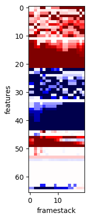

# deeptrade

A series of experiments for learning to trade with RL.

See writeup here: https://medium.com/@andytwigg/learning-to-trade-with-deep-rl-666ed6bbd921



# quick start

First get data and setup conda/venv
```
git clone git@github.com:andytwigg/deeptrade.git
cd deeptrade
pip install -r requirements.txt
# NB you may need to conda install gxx_linux-64 for mpi4py
```
Get the data (from S3) (TODO) and add env variable:
```
export DEEPTRADE_DATA=<path_to_deeptrade-data>
```

All the training, model, agent and env config parameters are stored in `config.json`.

Play random rollouts:
```
python -m deeptrade.play --config config.json --random
```

Start a training run (using cpu parallelism via vecenv):
```
python -m deeptrade.train --config config.json
```
The number of parallel rollout workers is controlled via the `nenvs` parameter in config.

To use multiple gpus:
```
RCALL_NUM_GPU=8 PYTHONPATH=. mpiexec -np 8 python -m deeptrade.train  --config.json
```
will use 8 GPUs, with 8 mpi processes, each process using `config.nenvs` rollout workers.

To "visualize" an environment, use the `play.py` script with `--curses`:
```
python -m deeptrade.play  --config config.json --curses --slow
```
(`--slow` will pause for keyboard press after each step)

For more config params, and various envs, agent, policies, please see `config.json` and the code :)


# setup
EC2: use Deep Learning AMI (Ubuntu) Version 15.0 `ami-06ddeee5b31a0308f`
Setup AWS keys using `./aws configure` and add ssh keys etc.

```
wget https://gist.githubusercontent.com/andytwigg/2e27d53e296aa77a3a4e32cfeab76fae/raw/b54004d89ba3fce2b7974b2f7949a737b3389267/.tmux.conf
# add these to `.bashrc`
echo "export DEEPTRADE_DATA=/home/ubuntu/deeptrade-data/" >> ~/.bashrc
echo "export OPENAI_LOG_FORMAT='stdout,log,csv,tensorboard'" >> ~/.bashrc
echo "export OPENAI_LOGDIR=/home/ubuntu/deeptrade-logs" >> ~/.bashrc
mkdir -p /home/ubuntu/deeptrade-logs/

# setup envs
# Recommended: using EC2 deep learning AMI and conda:
source activate tensorflow_p36
pip install tensorflow-gpu==1.12 # or tensorflow==1.12

# install ta-lib (needed for python wrapper TA-lib)
# see https://github.com/mrjbq7/ta-lib#dependencies
wget http://prdownloads.sourceforge.net/ta-lib/ta-lib-0.4.0-src.tar.gz
tar -xzf ta-lib-0.4.0-src.tar.gz
cd ta-lib/
./configure --prefix=/usr
make
sudo make install

# ubuntu
sudo apt-get update && sudo apt-get install cmake libopenmpi-dev python3-dev zlib1g-dev
# apt-get install mpich build-essential
# osx: brew install cmake openmpi

git clone git@github.com:andytwigg/deeptrade.git
cd deeptrade
pip install -r requirements.txt
# NB you may need to conda install gxx_linux-64 for mpi4py

# get just split files needed for training
cd ~
mkdir -p deeptrade-data/
aws s3 sync s3://deeptrade.data/gdax_book/BTC-USD/snapshots/ deeptrade-data/gdax_book/BTC-USD/snapshots
aws s3 sync s3://deeptrade.data/gdax_book/BTC-USD/split/ deeptrade-data/gdax_book/BTC-USD/split/
aws s3 sync s3://deeptrade.data/candles/gdax/ deeptrade-data/candles/gdax/

# or get all the data (warning: lots)
mkdir -p deeptrade-data
aws s3 sync s3://deeptrade.data/ deeptrade-data
```


# data collection and processing

## data collection
we run several data collection nodes, then merge + deduplicate the data offline to reduce gaps in the message feed.
```
tmux
mkdir -p deeptrade-data/gdax_book
cd deeptrade
PYTHONPATH=. ./scripts/gdax-run.sh &> gdax-feed.out
```

you may want to add a cron job to push to s3:
```
crontab -e
0 0 * * * aws s3 sync /home/ubuntu/deeptrade-data/ s3://deeptrade.data/
```

## processing
The raw msg logs come from several collector nodes so you need to remove duplicates, merge and sort:

```
export DEEPTRADE_HOME=/home/ubuntu/deeptrade
export DEEPTRADE_DATA=/home/ubuntu/deeptrade-data
cd $DEEPTRADE_DATA/gdax_book/BTC-USD
$DEEPTRADE_HOME/scripts/update-data.sh BTC-USD
```
This should leave you with a directory `gdax_book/BTC-USD/split/` containing files where each begins with a snapshot message and 0 or more non-snapshot messages.

## check files
```
cd deeptrade
PYTHONPATH=. python -u deeptrade/data/check_files.py --data=$DEEPTRADE_DATA | tee to_remove
cd $DEEPTRADE_DATA/gdax_book/BTC-USD/split
cat to_remove | grep 'ERROR' | cut -d' ' -f 1 | xargs rm
rm to_remove
```


# simple example of tradenv with stable-baselines

```
import os
from stable_baselines.common.vec_env import DummyVecEnv
from stable_baselines.deepq.policies import MlpPolicy as DQNMlpPolicy
from stable_baselines.common.policies import MlpPolicy as MlpPolicy
from stable_baselines import DQN, PPO1, PPO2
from deeptrade.envs import make_tradeenv

env_id = 'ladder-spooner'
data = 'l2file:{}'.format(os.environ['DEEPTRADE_DATA'])
env_args = {'mintime':60.0, 'minprice':0.0}
env = DummyVecEnv([lambda: make_tradeenv(env_id, data, env_args)])

model = DQN(DQNMlpPolicy, env, tensorboard_log=None, verbose=1)
model.learn(total_timesteps=50000)
```

